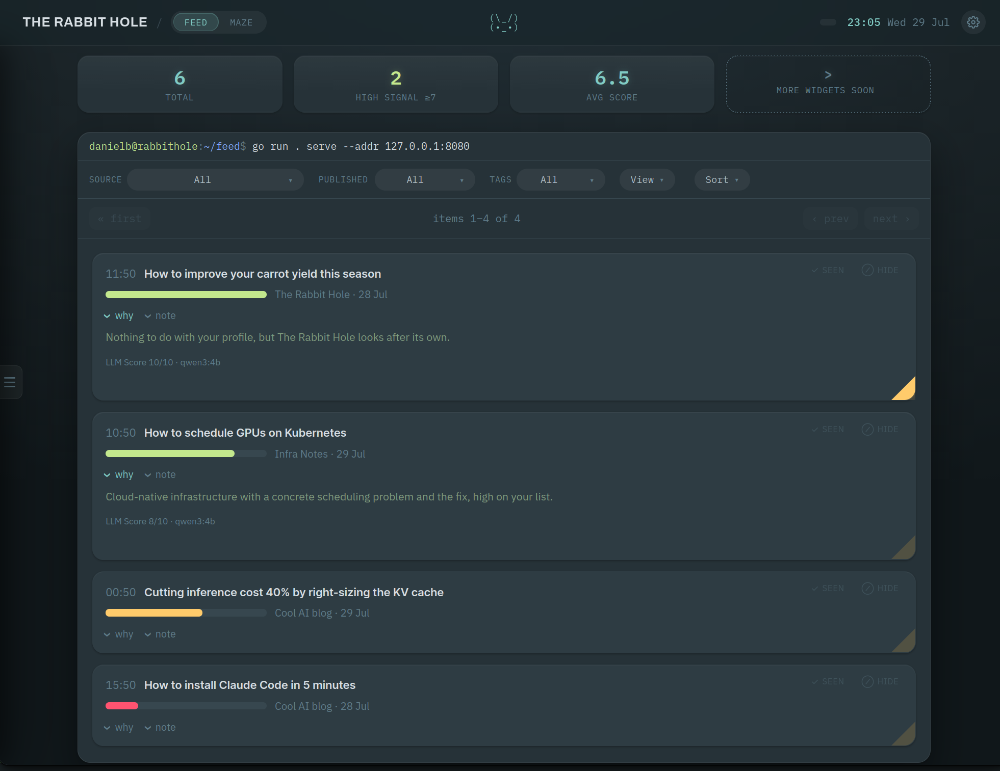

<p align="center">
  
</p>

<p align="center">
  <a href="https://github.com/DanielBlei/rabbithole/actions/workflows/ci.yml"></a>
  <a href="go.mod"></a>
  <a href="LICENSE"></a>
  
</p>

**The Rabbit Hole** is a personal RSS reading assistant. It fetches your RSS/Atom feeds
(Medium, arXiv, blogs, etc), scores each item against an interest profile you write yourself,
creating a unique, personalised ranked feed.

Open it in your browser. The **Feed** page is the day's reading ranked. The **Maze** page is
where you put down tasks or todos, and throw ideas at the board before they get away.

Everything runs on your own machine, and state is written to a local SQLite file.

<p align="center">
  
</p>

<!-- Remove once 0.1.0 is tagged. -->
> **Status:** pre-release. No tagged release yet; `main` is the only supported version.

## Requirements

- Go 1.26+
- [Ollama](https://ollama.com) running locally (the default)
- or any OpenAI-compatible endpoint, such as [vLLM](https://docs.vllm.ai)
- or nothing, with the built-in `heuristic` scorer

## Quickstart

```bash
make setup                              # creates configs/{config,feeds,profile} from the examples
ollama pull qwen3:4b                    # the default model
CONFIG=./configs/config.yaml make serve
```

Open <http://localhost:8080> and hit ingest. The first run fetches your feeds and scores
them, which takes a while on a local model; after that the page fills in.

Then edit `configs/profile.md`, what you care about in your own words, and `configs/feeds.yaml`.
The profile is the one that matters most: the model is handed it verbatim on every scoring
call, so it decides what surfaces and what does not.

`make serve` binds to loopback only and has no authentication: it assumes it is running on
your own machine. Read [SECURITY.md](SECURITY.md) before exposing it to anything else.

## Documentation

- [docs/quickstart.md](docs/quickstart.md): the same steps with the details filled in
- [docs/configuration.md](docs/configuration.md): every field in the three config files
- [docs/cli.md](docs/cli.md): the `ingest`, `items` and `serve` commands
- [docs/api.md](docs/api.md): the HTTP API
- [docs/architecture.md](docs/architecture.md): how the pieces fit together
- [docs/store.md](docs/store.md): the SQLite schema and item lifecycle

## Contributing

Ideas and patches are welcome. For anything beyond a small fix, please open an issue first,
so you do not end up building against a decision you had no way of seeing. Small fixes can
come straight as a PR. See [CONTRIBUTING.md](CONTRIBUTING.md).

## License

Licensed under the [Apache License, Version 2.0](LICENSE).
