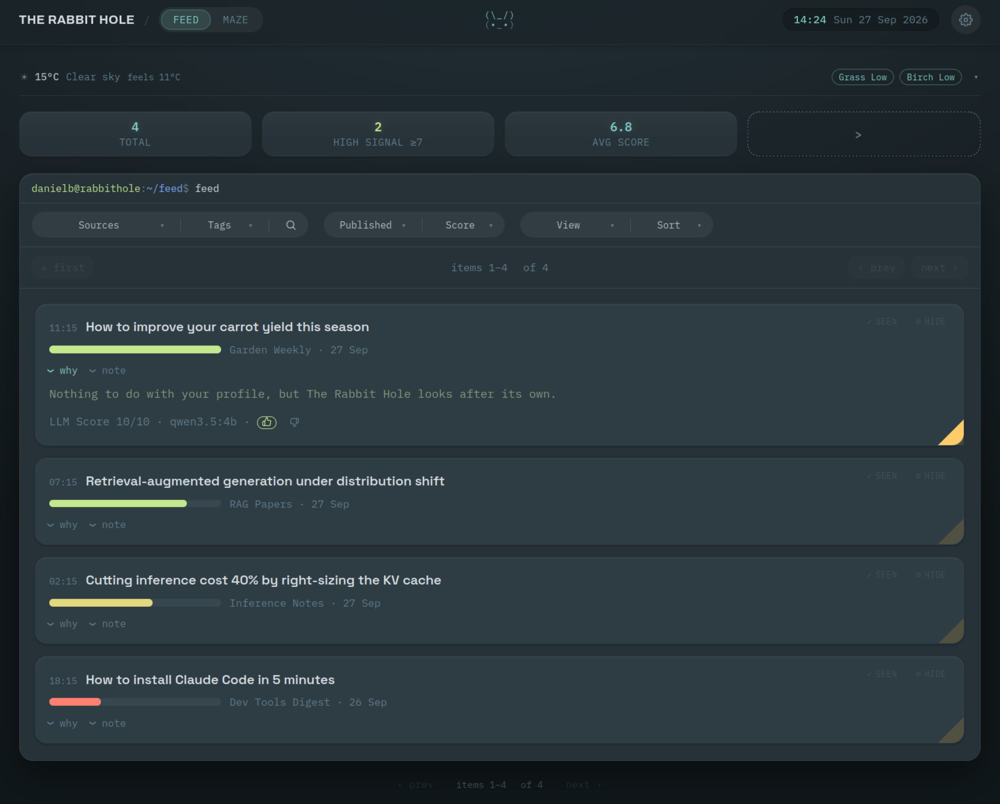

<p align="center">
  
</p>

<p align="center">
  <a href="https://github.com/DanielBlei/rabbithole/actions/workflows/ci.yml"></a>
  <a href="go.mod"></a>
  <a href="LICENSE"></a>
  
  <a href="#what-it-reads"></a>
</p>

**The Rabbit Hole** finds what is worth your reading time. You describe your interests in plain
words; it pulls new items from the sources you follow (RSS/Atom feeds, arXiv, Crossref and
Semantic Scholar) and ranks each one against that profile, with a one-line reason for its score.
What you get is a reading list ranked by what you actually care about.

Open it in your browser. The **Feed** page is the day's reading ranked. The **Maze** page is
where you put down tasks or todos, throw ideas at the board before they get away, and keep an
eye on the weather.

It runs on your own machine: one binary with the UI inside it, no dependency hell, and state in
a local SQLite file, or in Postgres, enabling one store to serve more than one machine.
Scoring runs on a local model, any OpenAI-compatible endpoint, or a built-in keyword scorer that
needs no model at all.

<p align="center">
  
</p>

> **Status:** 0.x. Usable day to day, but the config format and the HTTP API can still change
> between releases. Anything breaking is called out in the release notes.

## What it reads

| Source | Type | Example URL |
|---|---|---|
| RSS / Atom feeds | `rss` | `https://next.redhat.com/feed/` |
| arXiv | `academic` | `https://arxiv.org/search?q=agentic+coding` |
| Crossref | `academic` | `https://api.crossref.org/works?q=llm&publisher=ACM` |
| Semantic Scholar | `academic` | `https://www.semanticscholar.org/search?q=code+agents&min_citations=5` |
| Blogs and news sites without a feed | planned | |

An academic source is a saved search: the URL's host picks the provider and its query says what
to look for. See [docs/configuration.md](docs/configuration.md#academic-sources).

## Requirements

- A scorer, one of:
  - [Ollama](https://ollama.com) running locally (the default)
  - any OpenAI-compatible endpoint, such as [vLLM](https://docs.vllm.ai)
  - nothing, with the built-in `heuristic` scorer
- optionally, Postgres (14 or newer) in place of the SQLite file, if one store has to serve more
  than one machine
- Go 1.26+, only to build from source

## Install

### Release binary

Linux or macOS:

```bash
curl -fsSL https://raw.githubusercontent.com/DanielBlei/rabbithole/main/scripts/install.sh | sh
```

It installs the latest release and can copy the default configs into a `rabbithole/` folder
where you run it. Archives are also on the
[Releases page](https://github.com/DanielBlei/rabbithole/releases).

### From source

```bash
git clone https://github.com/DanielBlei/rabbithole.git
cd rabbithole
make build
```

`go install github.com/DanielBlei/rabbithole@latest` gives the same binary; copy a config from
[configs/](configs) (`make setup` does it in a checkout).

## Quickstart

```bash
ollama pull qwen3.5:4b   # the default model
make serve               # runs on the shipped example config
```

Open <http://localhost:8080> and hit ingest. The first run fetches the feeds and scores them,
which takes a while on a local model; after that the page fills in.

That ranks against the immutable built-in **Default** profile. Open
**Settings → Profiles** to create or duplicate one for your own interests; the next ingest
uses it immediately. Existing scores stay historical until you explicitly choose
**Rescore recent items**, which recomputes the last seven days from stored article data.
Add your own sources from the **Sources** page: an RSS or Atom URL, or pick **academic** for
an arXiv, Crossref or Semantic Scholar search. For the full setup, see
**[docs/quickstart.md](docs/quickstart.md)**.

The first visit asks who can open it: create an account, or leave it open with no login.
`make serve` binds to loopback only; read [docs/auth.md](docs/auth.md)
and [SECURITY.md](SECURITY.md) before exposing it to anything else.

## Documentation

- [docs/quickstart.md](docs/quickstart.md): the same steps with the details filled in
- [docs/configuration.md](docs/configuration.md): every field in the three config files
- [docs/cli.md](docs/cli.md): the `ingest`, `items`, `serve` and `auth` commands
- [docs/api.md](docs/api.md): a small read-and-mark JSON API
- [docs/auth.md](docs/auth.md): the login, sessions, HTTPS, and resetting a forgotten password
- [docs/architecture.md](docs/architecture.md): how the pieces fit together, and the roadmap
- [docs/evals.md](docs/evals.md): checking whether the model actually agrees with your profile
  (`eval benchmark` and `eval audit`)
- [docs/store.md](docs/store.md): database internals for operators and contributors: engines,
  schema, upgrades

## Getting help

Questions, or something not behaving? Open an issue. Security reports go privately through
[SECURITY.md](SECURITY.md) instead.

## Contributing

Ideas and patches are welcome. For anything beyond a small fix, open an issue first, so we
can agree the approach before you spend an evening on it. See [CONTRIBUTING.md](CONTRIBUTING.md).

## Acknowledgements

Weather and pollen data by [Open-Meteo](https://open-meteo.com).

The fonts are open source and come bundled with the app, so it looks the same offline. Their
licences sit next to them in [internal/web/static/fonts](internal/web/static/fonts).

## License

Licensed under the [Apache License, Version 2.0](LICENSE). The bundled fonts keep their own
licences, linked above.
