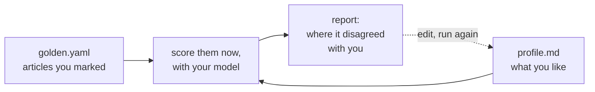
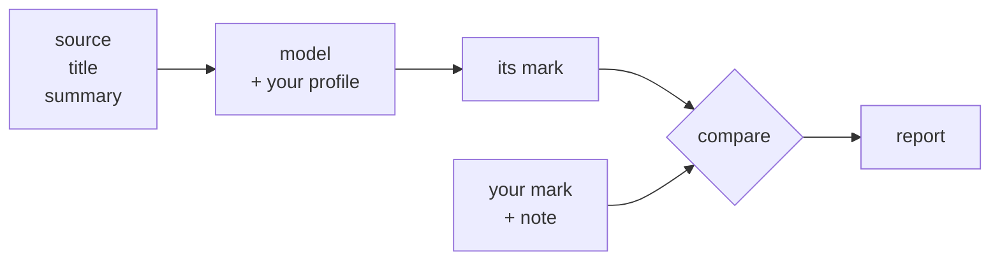

# Evaluation

## Why

`profile.md` decides what scores well, and you write it blind. Change a line and your feed
changes, but nothing tells you whether it got better or worse. `rabbithole eval benchmark`
closes that loop: you mark a handful of articles yourself, and it shows you where the model
disagreed with you.

## How it works



It scores the articles **now**, rather than reading marks recorded earlier. That is the whole
point: two runs either side of an edit are directly comparable, so you can tell whether the
edit did anything. Nothing is written to the store and your profile is never rewritten.

## The set of articles

Copy `configs/golden.example.yaml` to `configs/golden.yaml` (`make setup` does this for you)
and replace the examples with articles from your own feeds. One looks like this:

```yaml
- id: rb001
  source: Source One
  title: "Running Qwen3-30B locally with llama.cpp on a single 3090"
  summary: |
    Walks through the quantisation choices, measures tokens/sec at q4_K_M
    against q8_0, and lists the llama.cpp flags that actually mattered.
  expected_llm_score: 10
  tags: [on-target]
  note: Profile "Running open-source language models" and "Practical write-ups".
```

`expected_llm_score` is the mark **you** would give, 0 to 10. Close is fine: if you said 9
and the model said 8, nothing is wrong. Two things make the set worth having:

- **You should be able to point at the reason.** `profile.md` says what you like, and the
  scoring guide in the system prompt turns that into a number. If neither explains your
  mark, add the missing line instead of changing the mark.
- **Include the awkward ones.** Anything can mark the obvious articles. What teaches you
  something is the sales pitch stuffed with your favourite words, and the genuinely good
  article that happens to use none of them.

`tags` are your own labels for grouping results, and have nothing to do with feed tags on
real items. Give each at least three articles, or its score is really just one article.

**What the model sees.** Only three fields reach it, exactly what a live article would give
it. Your mark never does, because that is the answer being tested.



A misspelled key, duplicate id, mark outside 0-10 or undeclared tag stops the run rather
than being quietly skipped.

## Running it

```
rabbithole eval benchmark [file] [--model M] [--provider P] [--host URL] [--no-think]
                          [--repeats N] [--limit N] [--show-why]
                          [--format text|markdown|json] [--output-path PATH]
```

| Flag | What it does |
|---|---|
| `--model`, `--provider`, `--host` | Use a different backend than your config, e.g. to try a bigger model than you ingest with |
| `--provider claude` | Score the set with Claude as a reference ceiling, to find out whether a bigger model would help. See below |
| `--no-think` | Turn off model reasoning for this run |
| `--repeats` | Score everything N times and report how much the answers wobbled |
| `--limit` | Score only the first N articles, in file order, for a quick pass |
| `--show-why` | Print the model's reasoning and your note beside each article |
| `--batch-size`, `--max-parallel` | Override the config for this run. Changes what is measured, so use the same values on every run you compare |
| `--format` | `text` (default), `markdown` or `json` |
| `--output-path` | Write to a file instead of the screen |

`text` is the default because reading a run is the common case: it is aligned columns and no
markup, 120 columns wide, and the same bytes whether it lands on a terminal or in a file.
`markdown` is the same report as a document, for pasting into an issue. `--limit` keeps file
order rather than drawing a sample, so a narrowed run stays comparable to the last one.

```sh
# your configured backend, against configs/golden.yaml
rabbithole eval benchmark

# a bigger model than you ingest with
rabbithole eval benchmark --model qwen3.6:35b

# no model at all: a keyword matcher, useful to check the plumbing works
rabbithole eval benchmark --provider heuristic

# save it, to compare against a later run
rabbithole eval benchmark --format json --output-path before.json

# the first ten only, with its reasoning beside your notes
rabbithole eval benchmark --limit 10 --show-why
```

Batch size and parallelism default to your config rather than to a flag, because a batched model
marks each article relative to the others beside it: batching differently from `ingest` would
measure something your feed never does. `--batch-size` and `--max-parallel` override them anyway,
for the case where that reasoning does not apply, such as a backend `ingest` never uses. Both are
recorded in the report's `BACKEND` line, so a run that used them says so. Progress goes to the
error stream and the report to the normal one, so `--format json > before.json` stays clean.

## Claude as a reference ceiling

A benchmark tells you the gap between your model and your marks, but not why the gap is there.
A high MAE can mean the model is too small, or that `profile.md` is ambiguous, or that one of
your marks is wrong. Those want opposite fixes, and the report cannot tell them apart.

`--provider claude` scores the same set with the Claude Code CLI, on your existing subscription,
and produces an ordinary report you can put beside the usual one:

```sh
rabbithole eval benchmark --format json --output-path ollama.json
rabbithole eval benchmark --provider claude --model sonnet --format json --output-path claude.json
```

Both reports carry the same `profile_hash`, `prompt_hash` and `dataset_hash`, which is what
proves the two runs differed only in the backend. Then compare `mae` and `qwk`. A large gap means
a bigger model would help. A small gap means it would not, and the thing to fix is your profile,
your prompt, or one of your marks.

**Claude is not the answer key.** Your marks are, and Claude is scored against them exactly like
any other backend. It only ever sees `profile.md` and the system prompt, so it does not know your
taste any better than your own model does. Read it as a ceiling, not a verdict, and never copy its
scores into `golden.yaml`: the set would stop measuring whether the model agrees with you and start
measuring whether it agrees with Claude, and nothing in the report would say so.

### What you are actually tuning

Three things decide a score, and the report's `INPUTS` line fingerprints all three so you can tell
which one you changed:

| | Fingerprint | What it is |
|---|---|---|
| `profile.md` | `profile_hash` | what you like. The main lever, and where most edits belong |
| the system prompt | `prompt_hash` | how a preference becomes a 0-10. Shared by every backend |
| `golden.yaml` | `benchmark_hash` | your marks, the answer key. Change it least |

Most of the work is the profile: it is the only one describing you, and a mark you cannot justify
from it usually means a line is missing rather than that the mark is wrong. The system prompt
carries the scale, not the taste, so it needs tuning less often, but it does need it sometimes:
if the model is ordering articles sensibly and still landing a band too low, that is the prompt's
job to fix, not the profile's. The report separates the two, since a run that discriminates well
but scores low shows up in `AT OTHER MARKS` rather than in `MAE`.

Change one at a time. Two runs whose `INPUTS` differ in two places cannot tell you which edit did
the work.

**`system_prompt: false` is refused with `--provider claude`.** For a local model, sending no
system message is a reasonable thing to try (an Ollama Modelfile may already carry one), and it
costs nothing to find out. For Claude it would mean scoring your set with Claude Code's own agent
persona instead of your scoring prompt, producing a report that looks normal but shares no
`prompt_hash` with anything else, at the cost of real allowance. Omit the setting to take the
built-in default, or point it at a file.

Before you use it:

- **It needs the `claude` CLI, logged in** (`claude auth login`). Runs go through your
  subscription's rolling allowance, the same one your interactive sessions draw on. Roughly
  $0.006 per article at list estimate, so a 50-article set is about $0.30-equivalent per run.
  Setting `ANTHROPIC_API_KEY` makes the same command bill the API instead.
- **A failed batch costs more than you expect.** A batch that comes back unparseable is retried
  article by article, up to three times each, so one bad response on a ten-article batch can cost
  thirty CLI calls. Runs are serialised by default for the same reason; `--max-parallel` lifts
  that if you want the wall clock back and can spare the allowance.
- **Raise `--batch-size` here.** Every call repeats the same fixed cost whatever it carries, so
  one call scoring ten articles is far cheaper than ten calls scoring one. See below.
- **Your profile and your articles leave the machine.** If you run a local model to keep them
  local, this is the one command that does not.
- **It cannot reach `ingest`.** `provider: claude` in your config is rejected, and
  `ingest --provider claude` fails. It exists only on this command, per run, because scoring live
  feeds with it would put a frontier model in front of unattended, untrusted, internet-sourced
  text on every run. Here the set is small, yours, and you are reading the output.

The run is confined: every tool is switched off, settings files and MCP servers are ignored, and
the process works from an empty scratch directory. It reads text and writes a score.

### What a batch costs

Batching works the same way for every backend, but it is with Claude that it shows up on a bill.
Each batch is one fresh, stateless call. Nothing is carried between them:

```
system:  <the system prompt>                    the scoring scale
user:    READER INTEREST PROFILE:
         <profile.md>                           your taste
         ARTICLES (untrusted feed content...):
         1. [Source] Title
            summary
         2. ...                                 batch_size of them
```

The next batch sends the whole thing again: same system prompt, same profile, next articles.
Article numbering restarts at 1 in every call, which is how scores are mapped back.

So the system prompt, your profile and the CLI's own scaffolding are paid once per **call**, not
once per run, and `--batch-size` is the divisor on that. Measured at roughly 2.5k input tokens of
fixed cost per call, a 35-article set works out at:

| | Calls | Fixed cost paid |
|---|---|---|
| `--batch-size 1` (default) | 35 | 35x |
| `--batch-size 10` | 4 | 4x |

Prompt caching does not rescue you: two sequential calls carrying an identical system prompt were
both billed as fresh input, with nothing read from cache. Measured on one shape of run rather than
guaranteed, but do not plan around caching making the repetition free.

On a 10-article slice, `--batch-size 10` ran 5.6x faster than the default (54s to 14.6s), and the
token saving is steeper than the clock saving.

**The catch is that it changes the answer, not just the price.** A batched model marks each
article against the others beside it rather than judging it alone, which is a different task. The
same 10 articles, same profile, same prompt, scored MAE 0.70 at `--batch-size 1` and 1.00 at
`--batch-size 10`. So pass the same `--batch-size` to both sides of any comparison, or you will
read batching as model quality. The `BACKEND` line records what each run used.

## Reading the report

**The report explains each number as it prints it**, so none of this needs memorising. Every
table carries a `MEASURES` column saying what the metric is, and a `RANGE` saying which way
is better, so the sections below are background rather than a decoder ring.

**Warnings come first.** When a run is not worth reading, the report says so at the top
rather than leaving you to infer it: a model answering with almost one value, no agreement
beyond chance, or articles it returned nothing for.

**Check the spread of marks next.** Everything else depends on it.

```
SCORE SPREAD  6 distinct values used, golden uses 11
  model   0×7 1×10 2×6 3×4 4×6 5×2
  golden  0×1 1×4 2×3 3×4 4×6 5×3 6×2 7×2 8×3 9×5 10×2
```

A model answering with one or two values out of eleven is not marking articles, it is
emitting a constant, and every other number is then measuring where your marks happen to
coincide with it. The report says so outright when it happens.

**The four headline numbers**, printed under `SCORING`. In plain words:

| Printed as | |
|---|---|
| `QWK` | Whether its marks relate to yours at all, once you discount lucky guesses. 1.0 is perfect, **0.0 means no relationship was found**, below 0 means it disagrees systematically. |
| `MAE` | How far off it is, in points. |
| `RMSE` | Always at least the average. The further above, the more a few bad articles account for the damage. |
| `SIGNED MEAN` | Which way it leans. A big number here means it is consistently too generous or too harsh, which is a different problem from being scattered. |

**Is the high-signal tier trustworthy?** Articles marked 7 or above get the high-signal
badge on the feed page and count toward the tile at the top. Nothing is hidden below it,
so this is about whether the badge is telling the truth.

| | Meaning |
|---|---|
| hit | It badged it, and you agree |
| noise | It badged it, and you don't |
| missed | You wanted it badged, and it didn't |

Precision is how much of what it badges deserves it. Recall is how much of what deserves it
gets badged.

**The sweep** shows the same thing at other marks, which is what turns a bad result into a
diagnosis:

```
SWEEP  the same measure at other marks
  MARK  BADGED  WANTED  PRECISION  CHANCE  RECALL
  3+    12      27      0.75       0.77    0.33
  4+    7       23      0.86       0.66    0.26
  5+    3       17      0.67       0.49    0.12
  6+    2       14      0.50       0.40    0.07
  7+    0       12      —          0.34    0.00
  8+    0       10      —          0.29    0.00
  9+    0       7       —          0.20    0.00
```

Read precision against `CHANCE`, never alone: `CHANCE` is what picking at random would score,
and nearly everything clears a low mark. Pulling ahead of it as the mark rises means the model
orders articles well and only the 7 is misplaced, which is a setting rather than a model
problem. Tracking it the whole way means the ordering carries no signal, and moving the mark
will not help. Above, the keyword matcher sits *below* chance at the lowest mark, pulls a
little ahead in the middle, and badges nothing at all from 7 up: some ordering, nowhere near
enough for the badge to fire. That is the right verdict for a keyword matcher tested on a set
built to catch one.

**By tag** is where a bad number becomes actionable. A poor average says only that marking
is off; one tag standing out says which kind of article it is off about.

```
BY TAG  worst first
  TAG                          N    MAE  SIGNED  DESCRIPTION
  on-target                    7   7.14   -7.14  what you most want to read
  clickbait-framing            3   6.33   -6.33  clickbait headline over a real article
  deep-but-off-topic           3   2.00   -2.00  excellent, wrong domain
```

Groups with fewer than three articles sort to the bottom and are marked with `*`, because
their number is one article rather than a pattern.

**Samples** lists every article, worst first, so the rows worth acting on read before the
ones that already agree. Unanswered articles have no distance to sort by and go last.

**`--show-why`** adds a `WHY` section: the model's reasoning beside your note, in the same
order. That pairing is what makes a failure fixable, because you can usually see which line
of your profile it followed. Read it alongside the spread above, though: a long agreement
built from one repeated mark is a warning, not a result.

**Unanswered articles are not zeros.** If the model returns nothing for one it is counted
separately and left out, since marking it 0 would quietly credit it for agreeing with every
low mark of yours.

**Noise floor** appears with `--repeats`. Nothing sets a temperature or a seed, so two
identical runs will not agree exactly. Measure that wobble before trusting a small win: a
change smaller than it is not evidence of anything.

## When it looks bad

| What you see | What it means | What to do |
|---|---|---|
| Only two or three different marks used | It isn't telling articles apart | Try a bigger model |
| `QWK` near 0.0 | Its marks bear no relation to yours | Bigger model, before touching your profile |
| Large `SIGNED MEAN`, misses all one way | Right order, wrong level | Reword your tiers |
| One tag much worse than the rest | It's wrong about that kind of article | Read that tag's articles with `--show-why` |
| Precision tracks `CHANCE` at every mark | The ordering carries no signal | Moving the 7 will not help |

## Comparing two runs

The header carries a fingerprint of your profile, the system prompt and the article set:

```
INPUTS     profile 07377fd54469 · prompt 351a9edc8435 · benchmark 070506edf6e0
```

Two reports only mean something side by side when two of the three match. Otherwise a
number that moved proves nothing about the change you think you made.

## Later: `eval audit`

`benchmark` asks *did my edit help*, on articles you curated. `audit` will ask *what
actually happened*, reading the marks already recorded for your real feed: which sources
earn their slot, where the model disagreed with your thumbs, how marks are spread.

It is not built yet and is hidden from `--help`. Two things it will have to get right:

- **A source's average mark is the wrong measure.** A busy feed averaging 3 with five
  articles at 9 is worth keeping, and the average says drop it.
- **Only the model name is recorded** against an item, not the provider or the settings. An
  audit spanning rows marked under different configurations can blame the profile for a
  configuration change.
