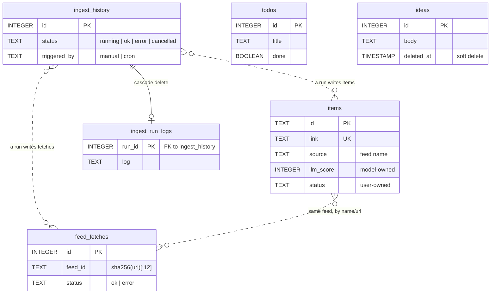
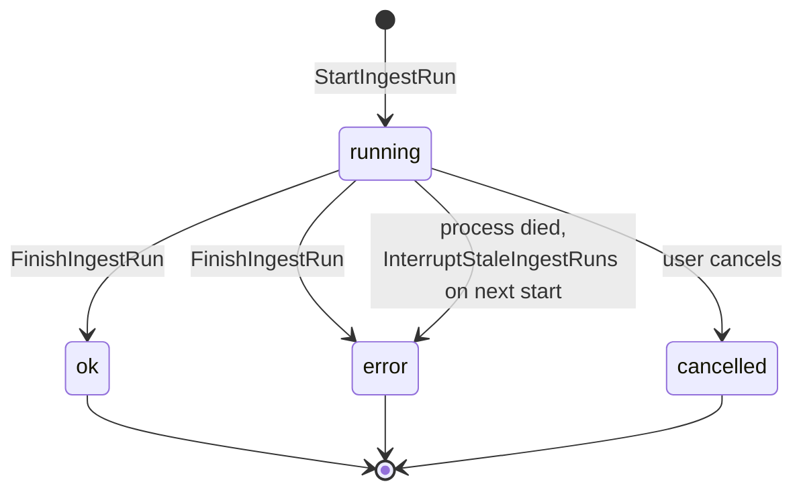
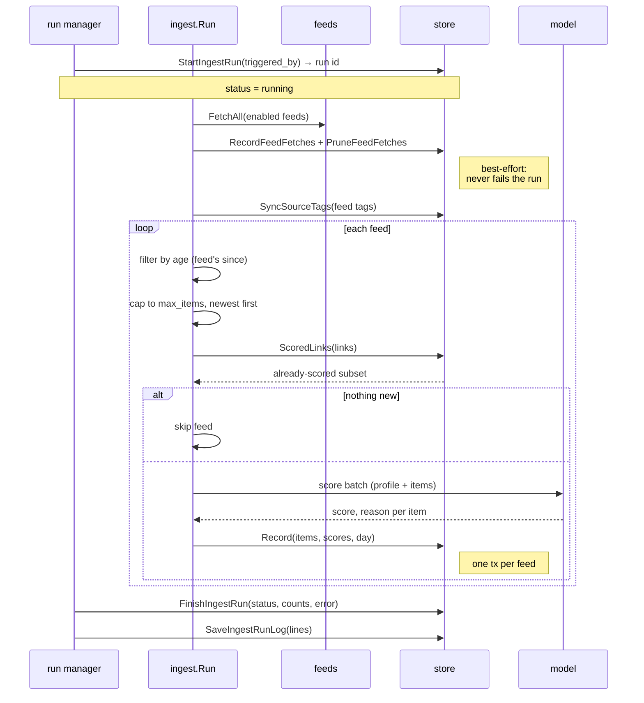
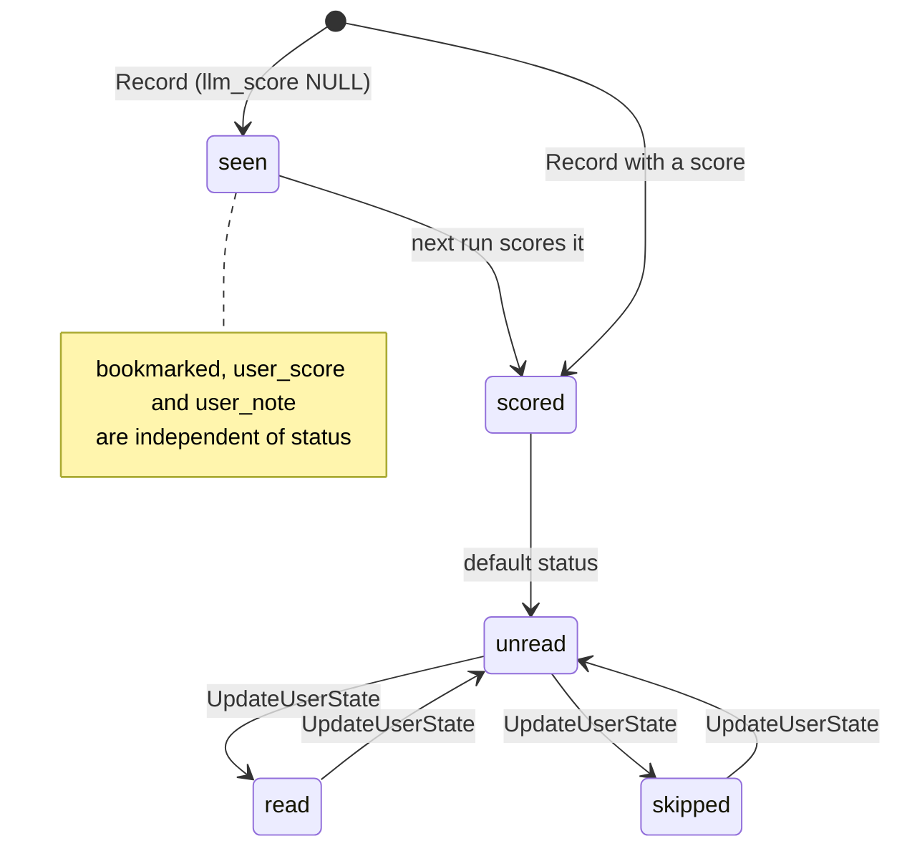

# Store

Everything persists in a single SQLite file at `store.db_path`, accessed through
`internal/store`. The setting is required and has no default; the shipped example config uses
`./data/rabbithole.db`.

> SQLite is the only supported backend. Postgres is on the roadmap, so that one person can
> reach the same store from more than one machine rather than each process owning its own local
> file.

Connection pragmas, applied per pooled connection via the DSN:

| Pragma | Reason |
|---|---|
| `journal_mode(WAL)` | Readers do not block the writer — the web UI stays responsive during an ingest run |
| `busy_timeout(5000)` | Wait rather than fail when a write is in progress |
| `foreign_keys(1)` | Enforce `REFERENCES` and `ON DELETE CASCADE` |
| `auto_vacuum(incremental)` | Reclaim space; only takes effect on a database created fresh |

## Schema at a glance

Solid lines are real foreign keys. Dotted lines are conventions the application maintains,
with no database constraint behind them — see [Boundaries](#boundaries).

Three groups, largely independent:

| Group | Tables | Written by |
|---|---|---|
| **Feed pipeline** | `items`, `feed_fetches` | `internal/ingest` |
| **Run history** | `ingest_history`, `ingest_run_logs` | `internal/ingest`'s run manager |
| **Maze boards** | `todos`, `ideas` | The web UI only |

## items

The core table: one row per article ever seen, whether or not it was scored.

| Column | Type | Notes |
|---|---|---|
| `id` | TEXT PK | Derived from the feed's entry id |
| `source` | TEXT | The feed's `name` at the time of ingest |
| `title` | TEXT | |
| `link` | TEXT UNIQUE | **The real identity.** Dedup and upserts key on this |
| `summary` | TEXT | Feed-provided summary, sent to the model |
| `published_at` | TIMESTAMP | From the feed; NULL when it publishes no date |
| `created_at` | TIMESTAMP | When this row was first written; stands in for `published_at` when the feed gives none |
| `updated_at` | TIMESTAMP | Touched by re-scoring and by user edits |
| `llm_score` | INTEGER | 0–10; NULL means seen but not yet scored |
| `llm_score_reason` | TEXT | The model's rationale |
| `llm_score_model` | TEXT | Model that produced the score, captured at scoring time |
| `digested_on` | DATE | Run day the item was selected for the digest |
| `status` | TEXT | `unread` \| `read` \| `skipped` |
| `user_score` | INTEGER | 0–10, your own rating; outranks `llm_score` in sorting |
| `user_note` | TEXT | Free text |
| `bookmarked` | BOOLEAN | |
| `tags` | TEXT | The source feed's tags, comma-joined; NULL when it has none |

Indexes: `digested_on`, `created_at`, `bookmarked`.

**Ownership.** The columns split in two, and the split is enforced by the write paths rather
than by the schema:

- **Model-owned** — `llm_score`, `llm_score_reason`, `llm_score_model`, `digested_on`. Only
  `Record` writes these.
- **User-owned** — `status`, `user_score`, `user_note`, `bookmarked`. Only `UpdateUserState`
  writes these, and it is the single mutation path shared by the CLI and the HTTP handlers.

`Record`'s upsert touches only the model-owned columns and is guarded by
`WHERE excluded.llm_score IS NOT NULL`, so a re-ingest can never blank a real score with
NULL, and re-seeing an article never resets your own state on it.

**Dedup.** `ScoredLinks` treats only a link with a non-NULL `llm_score` as done. A row
recorded without a score is reported as absent so the next run retries it — a scoring
failure costs one run, not the article.

**Date windows.** `List` and `Count` filter on `COALESCE(published_at, created_at)`, an
item's own date falling back to when we first saw it, with a matching index. `After` is
inclusive and `Before` exclusive.

**Deletion.** `PruneItems` deletes items matching a `PruneFilter` (source, a date window, or
both) and reports how many went; `PrunePreview` answers the same question without deleting,
and both build one predicate so they cannot disagree. Nothing references `items`, so a prune
reaches the feed and nothing else.

Unlike `ListFilter`, whose zero value means "everything", a zero `PruneFilter` is invalid.
Emptying the feed takes `All`, which cannot be combined with the other selectors — the point
is that it can't be reached by an unset field, not that it can't be reached. Bookmarked,
rated and noted items are kept
unless `IncludeSaved`: that state is the only part of a row re-ingest cannot restore. A
pruned link its feed still lists returns on the next run, rescored from scratch, because
`ScoredLinks` only sees rows that still exist.

## feed_fetches

Append-only log of every feed fetch attempt, one row per feed per run.

| Column | Type | Notes |
|---|---|---|
| `id` | INTEGER PK | |
| `feed_id` | TEXT | `config.FeedID` — the first 12 hex chars of `sha256(url)` |
| `feed_name` | TEXT | Denormalized label as of that fetch |
| `url` | TEXT | Denormalized |
| `status` | TEXT | `ok` \| `error` |
| `error` | TEXT | Empty on success |
| `items` | INTEGER | Items returned **before** age and cap filtering |
| `elapsed_ms` | INTEGER | |
| `fetched_at` | TIMESTAMP | |

Indexed on `(feed_id, fetched_at DESC, id DESC)`, which is exactly what the health query
walks. `FeedHealthByID` aggregates this into the status dot, failure streak, last success
and recent-attempt strip in the feeds viewer.

Keying on `feed_id` rather than the name is why renaming a feed keeps its history and
changing its URL starts fresh. Rows for feeds no longer in `feeds.yaml` are simply never
read, so re-adding a feed restores its history.

`PruneFeedFetches` keeps the newest 200 rows per feed and runs at the end of every fetch
phase. This is the only automatic retention policy; items have a manual one in `PruneItems`.

## ingest_history and ingest_run_logs

One row per run, plus that run's captured log in a side table so listing runs never drags
the log bodies along.

| Column | Type | Notes |
|---|---|---|
| `id` | INTEGER PK | |
| `started_at` | TIMESTAMP | |
| `finished_at` | TIMESTAMP | NULL while the run is live |
| `status` | TEXT | `running` \| `ok` \| `error` \| `cancelled` |
| `triggered_by` | TEXT | `manual` \| `cron` |
| `fetched` | INTEGER | Items inside the recency window, all feeds |
| `new_items` | INTEGER | Not-yet-seen items considered for scoring |
| `scored` | INTEGER | Items the model scored |
| `skipped` | INTEGER | Already-scored items skipped |
| `failed` | INTEGER | Items the model failed to score |
| `error` | TEXT | Failure message for `error` / `cancelled` |

`ingest_run_logs` is `run_id` (PK, FK → `ingest_history` `ON DELETE CASCADE`) plus `log`.
It holds the only real foreign key in the database.

`running` is therefore a claim about a live process, not durable truth. A crash leaves the
row stale, and `InterruptStaleIngestRuns` reconciles it at the next startup rather than
letting the UI show a run that has not moved in days.

Only the CLI's `ingest` command bypasses this table — it runs the cycle directly, so
CLI runs do not appear in the run history. Web-triggered runs go through the manager, which
is single-flight.

## todos and ideas

The Maze board, entirely separate from the feed pipeline and written only by the web UI.

**todos** — `id`, `title` (≤80 chars), `note`, `done`, `due_on` (`YYYY-MM-DD` text, sortable
lexicographically), `completed_at`, `tags` (comma-joined), `created_at`, `updated_at`.
Indexed on `done` and `due_on`. Deletes are hard.

**ideas** — `id`, `body` (≤280 chars), `color` (from `store.IdeaColors`), `position`,
`created_at`, `updated_at`, `deleted_at`. Indexed on `(deleted_at, position)`. Deletes are
soft: `DeleteIdea` stamps `deleted_at` and every read filters on it. `ReorderIdeas` rewrites
`position` for drag-and-drop.

Note the inconsistency: todos delete hard, ideas delete soft. That is deliberate — a
sticky note is cheap to restore and easy to knock off a board by accident — but it is worth
knowing before either table grows features.

## An ingest run, end to end

Two properties worth preserving:

- **Feed isolation.** Scoring and recording happen per feed, in that feed's own transaction.
  A feed that fails to score is logged and skipped; feeds already committed are not lost.
- **Dedup precedes scoring.** `ScoredLinks` runs before the model is called, so the
  expensive step only ever sees genuinely new items. The scorer itself is built lazily, so a
  run with nothing new never contacts the backend at all.

## Item lifecycle

`status` is a single value; bookmarking and rating are orthogonal flags on the same row, not
states. Nothing on the ingest or web paths deletes an item; the one way out is `PruneItems`,
which you drive from `items prune`.

## Boundaries

Three relationships exist by convention only, with no constraint enforcing them:

- **`items.source` → the feed's `name`.** Renaming a feed leaves already-stored items under
  the old name, where they appear as a separate source. History follows the URL; stored
  items follow the name.
- **`items.tags` → the feed's tags.** Copied in at insert time. Since a scored item is never
  re-inserted, retagging a feed reaches existing items only through `SyncSourceTags`, which
  runs at server startup and at the start of every ingest run.
- **`feed_fetches.feed_id` → a feed in `feeds.yaml`.** Derived from the URL, so the store
  has no idea whether the feed is still configured.

All three follow from feeds living in a YAML file rather than in the database. Moving feed
management into the store would turn them into real foreign keys — and would be the natural
first step for editing feeds from the UI.

## Schema version

Each table's DDL lives beside its feature (`todos.go`, `ideas.go`, …) and is listed in
`allSchemas`. On a database with no tables, `Open` applies them all and records
`schemaVersion` in SQLite's `user_version`. On an existing one it compares the two and
returns `ErrSchemaVersion` on a mismatch, naming the file rather than touching it.

Changing the schema therefore means editing the `CREATE TABLE` block and raising
`schemaVersion`. Existing databases are then refused until they are replaced, which is
cheap while the data is re-derivable from feeds. Upgrading one in place — most likely a
script — is a question for when that stops being true.

## Known gaps

- **Unbounded growth.** Only `feed_fetches` prunes on its own; `items` has `items prune` but
  nothing calls it for you. `ingest_history`, `ingest_run_logs` and completed `todos` grow
  forever. Nothing is large enough to matter yet, but `ingest_run_logs` is the first to
  watch — it stores whole run logs.
- **Deleting does not shrink the file.** `auto_vacuum(incremental)` only takes on a database
  created with it, so on an existing one freed pages go to the freelist and get reused
  rather than returned. Reclaiming disk means running `VACUUM` by hand with the server
  stopped.
- **No `Store` interface.** Callers take `*store.Store` directly. Supporting a second backend
  means introducing one first.
- **Feeds are not in the database**, which is what makes the three soft links above soft.
