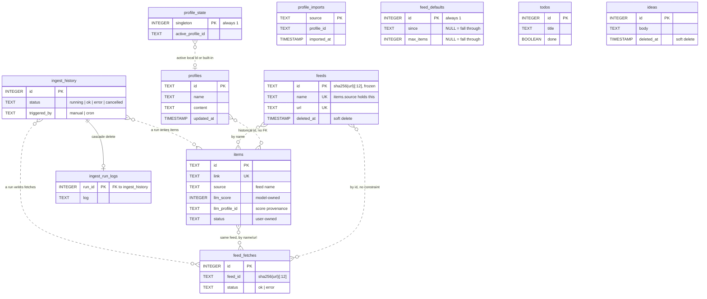
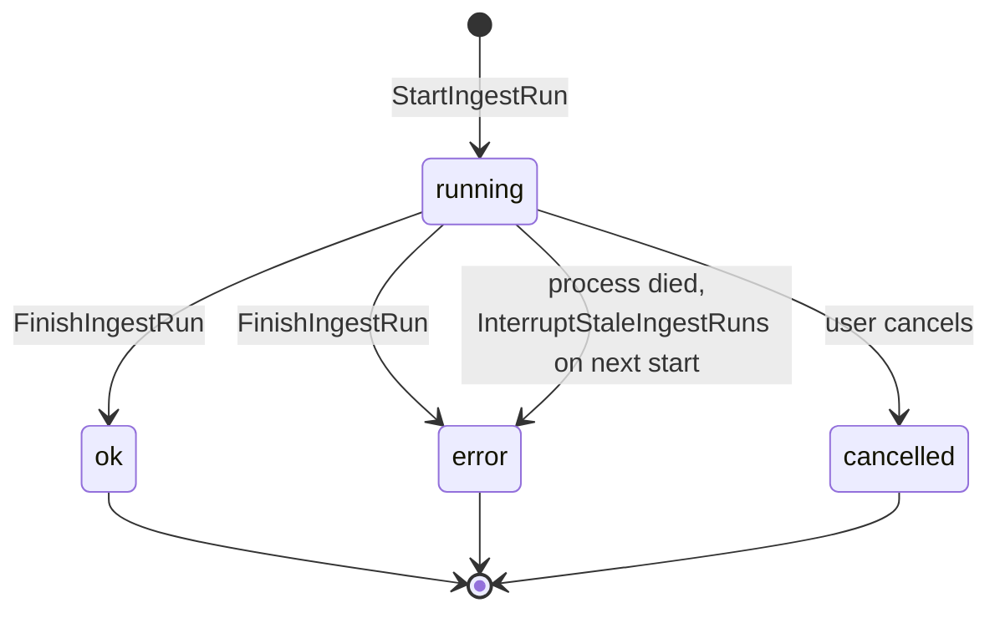
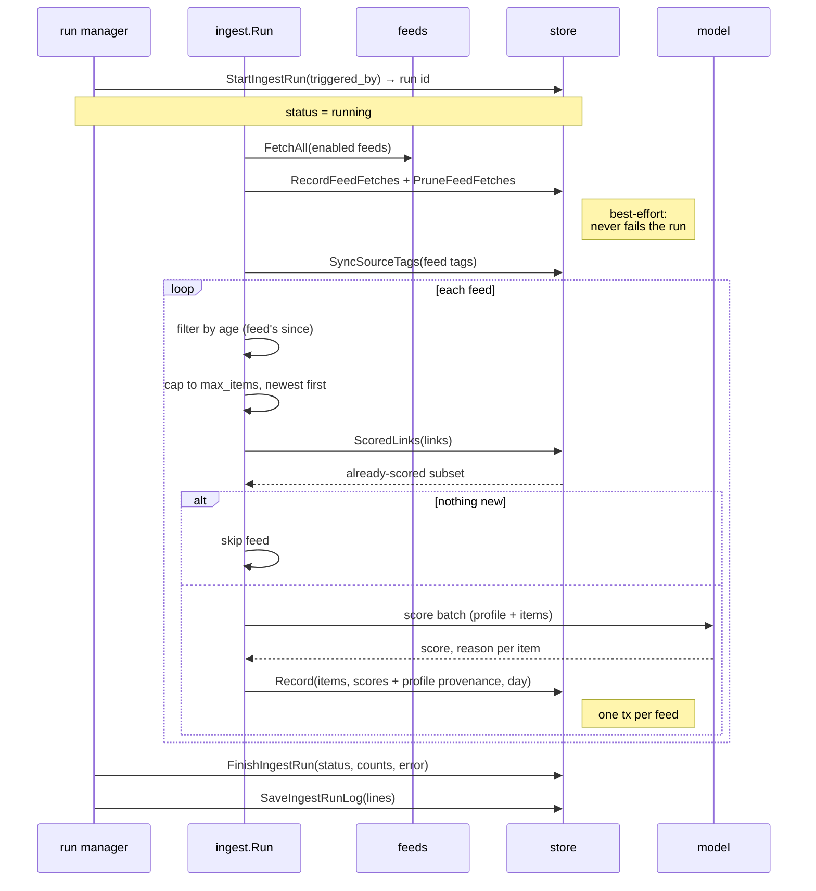
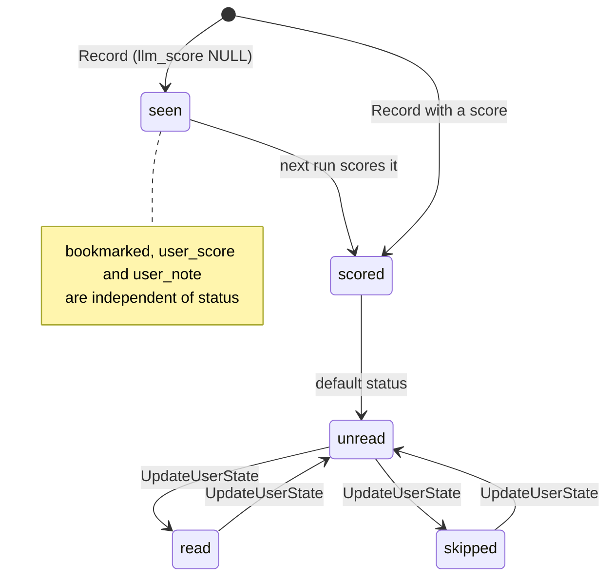

# Store

Everything persists through `internal/store`, on one of two engines. `store.db_path` is a
SQLite file, the local default, and the shipped example config uses `./data/rabbithole.db`.
`store.url` is a Postgres connection instead, for reaching the same store from more than one
machine. Exactly one of the two is set; see [configuration](configuration.md#store).

## One implementation, two engines

There is no `Store` interface and no second implementation. Queries are written once, in the
form SQLite accepts, and a `dialect` (`internal/store/dialect.go`) translates the few things
the engines spell differently. With 57 methods and a single implementation, an interface would
duplicate every signature and buy nothing.

The whole divergence is five items:

| | SQLite | Postgres |
|---|---|---|
| Placeholders | `?` | `$1, $2, …`, renumbered by `rebind` |
| Substring test | `instr(…)` | `strpos(…)` |
| DDL | beside each feature, e.g. `todoSchema` | its twin, e.g. `todoSchemaPG` |
| Schema version | `PRAGMA user_version` | a one-row `schema_version` table |
| Unique violation | message text | SQLSTATE 23505 |

That list is a budget rather than an observation. Most of what looks like a dialect problem is
only old SQL: the driver embeds SQLite 3.53, so `RETURNING`, `IS DISTINCT FROM` and
`TRUE`/`FALSE` all work, and writing SQL both engines accept removes the branch instead of
hiding it. If the table above grows past a handful of rows, two separate implementations
become easier to reason about than a seam that wide.

Queries never touch the database handle directly; they go through `query`/`queryRow`/`exec`
and the transaction wrappers, which is what applies `rebind`. A statement that bypassed them
would work on SQLite and fail on Postgres, so `TestNoDirectDatabaseAccess` fails the build
instead of leaving that to review.

## One writer at a time

Only one `rabbithole serve` may point at a store, on either engine. Machines take turns. Four
things depend on it, and none is enforced in code:

- **Ingest runs are reconciled at startup.** `InterruptStaleIngestRuns` flips every `running`
  row to `error`, which is right after a crash and wrong if another server is mid-run. Fixing
  it properly needs an owner and a heartbeat on `ingest_history`, and so a schema version bump.
- **The run manager is single-flight per process**, so two servers would score the same items
  twice and spend the model calls twice.
- **Sessions live in memory** (`internal/web/auth.go`), so each server keeps its own. The `gen`
  and `signing_key` columns do carry password changes and remember-me cookies across
  processes correctly.
- **The login rate limiter is per process**, so lockout could be sidestepped via the second one.

Two concurrent requests inside one server are fine and are handled: the feed conflict probe is
a check-then-act, and on Postgres the loser comes back as `ErrFeedNameTaken` rather than a raw
constraint error, so the Sources page still shows it against the field.

## Postgres connections

The pool is capped in `dialect.go` rather than in config, since nothing has needed tuning:
10 open, 5 idle, a 30 minute lifetime and a 5 minute idle timeout. The lifetime is the one
that matters against a hosted database, where a pooler recycles server connections underneath
a handle held open forever.

Timestamps are `TIMESTAMPTZ`, which resolves to microseconds, where SQLite stores the
nanosecond text layout below. Nothing in the feed pipeline works at that scale, but two
timestamps less than a microsecond apart are distinguishable on one engine and equal on the
other.

## SQLite pragmas

Applied per pooled connection via the DSN:

| Pragma | Reason |
|---|---|
| `journal_mode(WAL)` | Readers do not block the writer — the web UI stays responsive during an ingest run |
| `busy_timeout(5000)` | Wait rather than fail when a write is in progress |
| `foreign_keys(1)` | Enforce `REFERENCES` and `ON DELETE CASCADE` |
| `auto_vacuum(incremental)` | Reclaim space; only takes effect on a database created fresh |

## Schema at a glance

Solid lines are real foreign keys. Dotted lines are conventions the application maintains,
with no database constraint behind them — see [Boundaries](#boundaries).

Three groups, largely independent:

| Group | Tables | Written by                          |
|---|---|-------------------------------------|
| **Feed config** | `feeds`, `feed_defaults` | The feed sources, seeded at startup |
| **Feed pipeline** | `items`, `feed_fetches` | `internal/ingest`                   |
| **Run history** | `ingest_history`, `ingest_run_logs` | `internal/ingest`'s run manager     |
| **Interest profiles** | `profiles`, `profile_state`, `profile_imports` | Settings UI, CLI/server bootstrap |
| **Maze boards** | `todos`, `ideas` | The web UI only                     |

## items

The core table: one row per article ever seen, whether or not it was scored.

| Column | Type | Notes |
|---|---|---|
| `id` | TEXT PK | Derived from the feed's entry id |
| `source` | TEXT | The feed's `name` at the time of ingest |
| `title` | TEXT | |
| `link` | TEXT UNIQUE | **The real identity.** Dedup and upserts key on this |
| `summary` | TEXT | Feed-provided summary, sent to the model |
| `published_at` | TIMESTAMP | From the feed; NULL when it publishes no date |
| `created_at` | TIMESTAMP | When this row was first written; stands in for `published_at` when the feed gives none |
| `updated_at` | TIMESTAMP | Touched by re-scoring and by user edits |
| `llm_score` | INTEGER | 0–10; NULL means seen but not yet scored |
| `llm_score_reason` | TEXT | The model's rationale |
| `llm_score_model` | TEXT | Model that produced the score, captured at scoring time |
| `llm_profile_id` | TEXT | Stable profile identity used for this score; NULL on historical rows |
| `llm_profile_name` | TEXT | Display name captured at scoring time |
| `llm_profile_hash` | TEXT | SHA-256 of the exact comment-stripped profile text used |
| `digested_on` | DATE | Run day the item's score was produced |
| `status` | TEXT | `unread` \| `read` \| `skipped` |
| `user_score` | INTEGER | 0–10, your own rating; outranks `llm_score` in sorting |
| `user_note` | TEXT | Free text |
| `bookmarked` | BOOLEAN | |
| `tags` | TEXT | The source feed's tags, comma-joined; NULL when it has none |

Indexes: `digested_on`, `created_at`, `bookmarked`.

**Ownership.** The columns split in two, and the split is enforced by the write paths rather
than by the schema:

- **Model-owned** — `llm_score`, `llm_score_reason`, `llm_score_model`, the three
  `llm_profile_*` columns and `digested_on`. `Record` writes them during ingest;
  `ReplaceItemScores` replaces score/provenance fields during an explicit rescore without
  changing `digested_on`.
- **User-owned** — `status`, `user_score`, `user_note`, `bookmarked`. Only `UpdateUserState`
  writes these, and it is the single mutation path shared by the CLI and the HTTP handlers.

`Record`'s upsert touches only the model-owned columns and is guarded by
`WHERE excluded.llm_score IS NOT NULL`, so a re-ingest can never blank a real score with
NULL, and re-seeing an article never resets your own state on it.

Profile provenance is historical metadata, not a live join. Renaming, editing, switching or
deleting a local profile does not rewrite scores already produced with it. The hash
distinguishes two versions that share one stable profile ID. Rows from before schema version 4
keep NULL provenance and remain readable. An explicit recent-item rescore replaces provenance
with the exact active-profile snapshot used by that operation.

`RecentScoredItems(cutoff)` supplies the rescore workflow with deterministic, newest-first
stored `feeds.Item` values. It uses `COALESCE(published_at, created_at)`, requires an existing
LLM score, and includes legacy scored rows whose profile provenance is NULL.
`ReplaceItemScores` performs the short database write only after model calls finish. It updates
successful score/reason/model/profile fields in one transaction while leaving user ratings,
notes, status, bookmarks, item metadata, tags and digest membership untouched.

## profiles and profile_state

`profiles` holds mutable local profiles:

| Column | Type | Notes |
|---|---|---|
| `id` | TEXT PK | Stable random ID, or deterministic `legacy-*` ID for config bootstrap |
| `name` | TEXT | Non-blank display name |
| `content` | TEXT | Canonical or arbitrary Markdown |
| `created_at` | TIMESTAMP | First insert |
| `updated_at` | TIMESTAMP | Last edit |

The built-in `builtin-default` profile is deliberately **not** a row. Its identity and content
belong to the application binary, so a database write cannot mutate or delete it. The schema
also rejects that reserved ID in `profiles`.

`profile_state` is one optional singleton row naming the active profile. No row means the
built-in Default. Its value may name Default or an existing local profile. Setting a local
profile validates that it exists; deleting the active local profile and switching the row to
Default happen in one transaction.

An explicitly configured legacy Markdown file is validated on every process start and
inserted under an ID derived from its absolute path. `profile_imports` records the absolute
source path independently of the mutable profile row, making the bootstrap one-time and
non-overwriting even if the imported profile is later deleted. It becomes active only on that
first import and only if `profile_state` has never been set.

**Dedup.** `ScoredLinks` treats only a link with a non-NULL `llm_score` as done. A row
recorded without a score is reported as absent so the next run retries it — a scoring
failure costs one run, not the article.

**Date windows.** `List` and `Count` filter on `COALESCE(published_at, created_at)`, an
item's own date falling back to when we first saw it, with a matching index. `After` is
inclusive and `Before` exclusive.

**Text and set filters.** `Search` keeps items whose title, source or tags contain the text,
case-insensitively; it uses `instr` rather than `LIKE '%x%'` so a `%` or `_` in what someone
typed is matched literally. `Sources` and `Tags` are multi-select: OR within each set, AND
with everything else, and `Sources` wins over the single `Source` the way `Statuses` wins
over `Status`. Because `tags` is one comma-joined column, a tag is matched with its
delimiters (`,AI,` against `,Infra,AI,`), so `AI` doesn't pull in `AIOps`. All of it lives in
one `whereClause` shared by `List` and `Count`, so the list and the totals beside it cannot
disagree.

**Deletion.** `PruneItems` deletes items matching a `PruneFilter` (source, a date window, or
both) and reports how many went; `PrunePreview` answers the same question without deleting,
and both build one predicate so they cannot disagree. Nothing references `items`, so a prune
reaches the feed and nothing else.

Unlike `ListFilter`, whose zero value means "everything", a zero `PruneFilter` is invalid.
Emptying the feed takes `All`, which cannot be combined with the other selectors — the point
is that it can't be reached by an unset field, not that it can't be reached. Bookmarked,
rated and noted items are kept
unless `IncludeSaved`: that state is the only part of a row re-ingest cannot restore. A
pruned link its feed still lists returns on the next run, rescored from scratch, because
`ScoredLinks` only sees rows that still exist.

## feeds and feed_defaults

The configured feed set — what to fetch and how. Written by the Sources section; `feeds.yaml`
only seeds feeds the store has never seen (see
[configuration](configuration.md#feeds)).

| Column | Type | Notes |
|---|---|---|
| `id` | TEXT PK | `config.FeedID` — `sha256(url)[:12]`, set on the first write and never changed |
| `name` | TEXT UNIQUE | What `items.source` records; unique so two feeds can't merge |
| `url` | TEXT UNIQUE | One feed per link. A missing scheme is filled in before the row is written, so the same address always gives the same `id` |
| `enabled` | BOOLEAN | NULL falls through to `feed_defaults`, then to the built-in `true` |
| `since` | TEXT | Written as typed (`7d`), NULL to fall through |
| `max_items` | INTEGER | NULL to fall through; `0` is uncapped |
| `tags` | TEXT | Comma-joined, like `items.tags` |
| `deleted_at` | TIMESTAMP | Soft delete |

Three things the column types decide:

- **The tuning columns are nullable because NULL is the point.** It means "take the
  default", matching the pointer fields on `config.Feed`. A zero would mean something
  else — `max_items` 0 is *uncapped*, not *nothing*.
- **`id` never changes after the first write.** `feed_fetches` uses the same value, so a
  feed keeps its history through both a rename and a change of URL. Building it from the URL
  rather than a counter also means a feed you add again, or seed into a fresh database,
  picks its old history back up.
- **Deletion is soft.** History stays with the feed in case it comes back, and seeding treats
  a deleted feed as one it has already seen — without that, removing a feed that came from
  `feeds.yaml` would undo itself on the next boot.

`feed_defaults` is a single row (`CHECK (id = 1)`) holding the same four tuning columns,
applied to any feed that leaves one unset. Names and URLs stay unique across deleted rows
too, so adding back something you removed restores that row rather than clashing with it.

## feed_fetches

Append-only log of every feed fetch attempt, one row per feed per run.

| Column | Type | Notes |
|---|---|---|
| `id` | INTEGER PK | |
| `feed_id` | TEXT | `config.FeedID` — the first 12 hex chars of `sha256(url)` |
| `feed_name` | TEXT | Denormalized label as of that fetch |
| `url` | TEXT | Denormalized |
| `status` | TEXT | `ok` \| `error` |
| `error` | TEXT | Empty on success |
| `items` | INTEGER | Items returned **before** age and cap filtering |
| `elapsed_ms` | INTEGER | |
| `fetched_at` | TIMESTAMP | |

Indexed on `(feed_id, fetched_at DESC, id DESC)`, which is exactly what the health query
walks. `FeedHealthByID` aggregates this into the status dot, failure streak, last success
and recent-attempt strip on the Sources section.

Keying on `feed_id` rather than the name is why renaming a feed keeps its history. The ID
is minted from the URL when the feed is first stored and then frozen on the row, so editing
a feed's URL keeps its history too. Rows for feeds no longer configured are simply never
read, so re-adding a feed restores its history — which is also why there is no foreign key
here: a cascade would throw that away.

`PruneFeedFetches` keeps the newest 200 rows per feed and runs at the end of every fetch
phase. This is the only automatic retention policy; items have a manual one in `PruneItems`.

## ingest_history and ingest_run_logs

One row per run, plus that run's captured log in a side table so listing runs never drags
the log bodies along.

| Column | Type | Notes |
|---|---|---|
| `id` | INTEGER PK | |
| `started_at` | TIMESTAMP | |
| `finished_at` | TIMESTAMP | NULL while the run is live |
| `status` | TEXT | `running` \| `ok` \| `error` \| `cancelled` |
| `triggered_by` | TEXT | `manual` \| `cron` |
| `fetched` | INTEGER | Items inside the recency window, all feeds |
| `new_items` | INTEGER | Not-yet-seen items considered for scoring |
| `scored` | INTEGER | Items the model scored |
| `skipped` | INTEGER | Already-scored items skipped |
| `failed` | INTEGER | Items the model failed to score |
| `error` | TEXT | Failure message for `error` / `cancelled` |

`ingest_run_logs` is `run_id` (PK, FK → `ingest_history` `ON DELETE CASCADE`) plus `log`.
It holds the only real foreign key in the database.

`running` is therefore a claim about a live process, not durable truth. A crash leaves the
row stale, and `InterruptStaleIngestRuns` reconciles it at the next startup rather than
letting the UI show a run that has not moved in days.

Only the CLI's `ingest` command bypasses this table — it runs the cycle directly, so
CLI runs do not appear in the run history. Web-triggered runs go through the manager, which
is single-flight.

## todos and ideas

The Maze board, entirely separate from the feed pipeline and written only by the web UI.

**todos** — `id`, `title` (≤80 chars), `note`, `done`, `due_on` (`YYYY-MM-DD` text, sortable
lexicographically), `completed_at`, `tags` (comma-joined), `created_at`, `updated_at`.
Indexed on `done` and `due_on`. Deletes are hard.

**ideas** — `id`, `body` (≤280 chars), `color` (from `store.IdeaColors`), `position`,
`created_at`, `updated_at`, `deleted_at`. Indexed on `(deleted_at, position)`. Deletes are
soft: `DeleteIdea` stamps `deleted_at` and every read filters on it. `ReorderIdeas` rewrites
`position` for drag-and-drop.

Note the inconsistency: todos delete hard, ideas delete soft. That is deliberate — a
sticky note is cheap to restore and easy to knock off a board by accident — but it is worth
knowing before either table grows features.

## auth

The web UI's login, in one row at most (`id` is pinned to 1): `username`, `pass_hash` (an
argon2id string in the PHC format, which records its own parameters), `mode` (`enabled` or
`disabled`), `gen`, `signing_key` and `updated_at`. No row at all means a fresh install, an
instance nobody has claimed yet, which serves only the setup page until a password is set or
the gate is switched off. Written by the web UI's setup page and by `rabbithole auth
reset|disable`.

`gen` is 128 random bits rewritten on every write. Sessions are not stored here: they live in
the server's memory, so a restart ends them, and each records the `gen` it was issued under,
so it stops matching once the row changes. That is how a CLI reset ends the sessions of a
server running in another process. The setup page's writes are conditional on the state it
read (`ON CONFLICT DO NOTHING` over no row, `WHERE gen = ?` over one), so two of them racing
cannot undo each other; the loser gets `ErrAuthChanged` and writes nothing.

`signing_key` is 256 random bits for the HMAC that signs "stay signed in" cookies, which carry
a session through a restart. Those cookies hold the `gen` too, so `RetireSessionsIf` (log out
everywhere: a new `gen`, nothing else) voids them along with every in-memory session; a new
password also brings a new key. It is conditional on the `gen` the caller's session was checked
against, so a password reset that lands first wins and the retire gets `ErrAuthChanged`.

## An ingest run, end to end

Two properties worth preserving:

- **Feed isolation.** Scoring and recording happen per feed, in that feed's own transaction.
  A feed that fails to score is logged and skipped; feeds already committed are not lost.
- **Dedup precedes scoring.** `ScoredLinks` runs before the model is called, so the
  expensive step only ever sees genuinely new items. The scorer itself is built lazily, so a
  run with nothing new never contacts the backend at all.

The explicit rescore path is separate: it selects scored rows from a fixed seven-day window,
never fetches feeds, and intentionally scores every selected candidate even when its stored
profile hash already matches. It shares the same run manager and `ingest_history`; the
`profile-rescore` trigger distinguishes it from ordinary manual or cron ingest runs.

## Item lifecycle

`status` is a single value; bookmarking and rating are orthogonal flags on the same row, not
states. Nothing on the ingest or web paths deletes an item; the one way out is `PruneItems`,
which you drive from `items prune`.

## Boundaries

Three relationships exist by convention only, with no constraint enforcing them:

- **`items.source` → the feed's `name`.** Renaming a feed leaves already-stored items under
  the old name, where they appear as a separate source. History follows the URL; stored
  items follow the name.
- **`items.tags` → the feed's tags.** Copied in at insert time. Since a scored item is never
  re-inserted, retagging a feed reaches existing items only through `SyncSourceTags`, which
  runs at server startup and at the start of every ingest run.
- **`feed_fetches.feed_id` → `feeds.id`.** Deliberately soft: history outlives the feed so
  that re-adding one restores it, which a foreign key with a cascade would prevent.

The first two follow from `items.source` holding the feed's *name*. `RenameSource` re-files
existing items when a feed is renamed, which keeps them from splitting into two sources, but
an `items.feed_id` column is the real fix and the natural next step.

## Schema version

Each table's DDL lives beside its feature (`todos.go`, `ideas.go`, `profiles.go`, …), as a
pair: the SQLite form and its Postgres twin, adjacent so neither can be changed without the
other being in view. Each dialect lists its own set in `schemas()`.

On a database that has never been set up, `Open` applies them all and stamps `schemaVersion`.
On an existing one it compares the two and returns `ErrSchemaVersion` on a mismatch, naming
the database rather than touching it. **Both engines carry the same number**; only where it
is kept differs, since `PRAGMA user_version` has no Postgres equivalent and a `schema_version`
table stands in.

Schema version 4 adds the profile tables and the three nullable provenance columns on `items`.
On SQLite that is an in-place upgrade from version 3, run in one transaction; a Postgres
database was never version 3, so it is only ever created at 4. Other unknown versions return
`ErrSchemaVersion`. Independent additive tables may still be created on every open without a
version bump where older code has no dependency on them.

The freshness check asks after a table the application owns rather than after the version
record, so a Postgres database holding these tables but no version row is refused instead of
being stamped over whatever is in it.

Changing the schema therefore means editing **both** `CREATE TABLE` blocks and raising
`schemaVersion`. Existing databases are then refused until they are upgraded or replaced.

Changing an owned live-state schema means editing the `CREATE TABLE` block, adding an ordered
transactional migration from the previous version, and raising `schemaVersion`. Databases with
recognized older versions are upgraded in place; unknown versions are refused without being
modified.

A new table that nothing older depends on may instead go in `additiveSchemas`, whose
`CREATE TABLE IF NOT EXISTS` runs on every open. This is reserved for independent features
that do not require a coordinated backfill or versioned column change; `auth` was the first.

## Known gaps

- **Unbounded growth.** Only `feed_fetches` prunes on its own; `items` has `items prune` but
  nothing calls it for you. `ingest_history`, `ingest_run_logs` and completed `todos` grow
  forever. Nothing is large enough to matter yet, but `ingest_run_logs` is the first to
  watch — it stores whole run logs.
- **Deleting does not shrink the file.** `auto_vacuum(incremental)` only takes on a database
  created with it, so on an existing one freed pages go to the freelist and get reused
  rather than returned. Reclaiming disk means running `VACUUM` by hand with the server
  stopped.
- **Two DDL blocks per table.** The engines' schemas are kept in step by hand, and nothing
  compares them. They sit adjacent in each file so a change to one is visible next to the
  other, which is a convention rather than a guarantee.
- **`items.source` holds the feed's name, not its ID.** Feeds are in the database now, so
  the link could be real; making it one means adding `items.feed_id`, backfilling it, and
  reworking every query that filters on `source`. Until then `RenameSource` keeps a rename
  from splitting a feed's items into two sources.
- **Deleted feed rows accumulate.** Nothing collects them, and each one goes on holding its
  name and URL against reuse. That is deliberate — it is what stops a re-seed from
  resurrecting a feed you removed — and it can be undone: the Sources section lists deleted
  feeds under the state filter's `deleted` option with a restore button, and adding the same
  URL again undeletes the row rather than failing.
